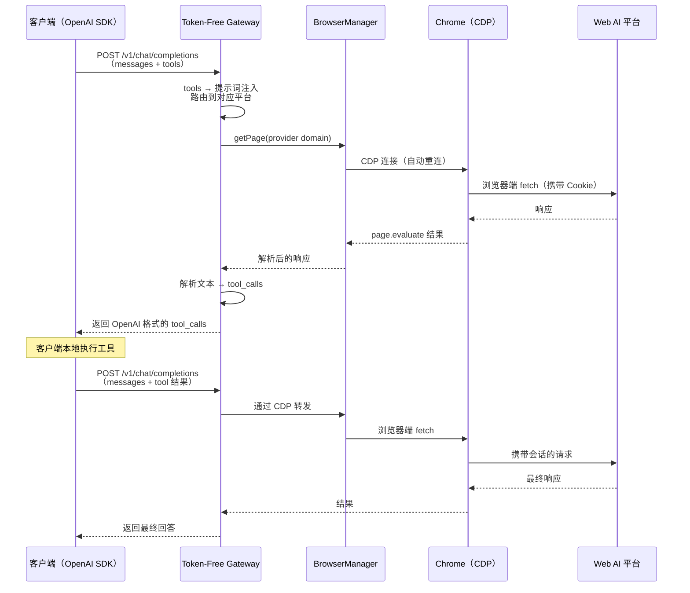

# Token-Free Gateway

**[English](README.md)**

免费使用 ChatGPT、Claude、Gemini、DeepSeek 等 14 个主流 AI 模型 —— **无需 API Key，只需浏览器登录**。

Token-Free Gateway 是一个轻量级 OpenAI 兼容 API 网关，将网页端 AI 会话转化为标准的 `/v1/chat/completions` 接口，完整支持 **Tools / Function Calling** 协议。任何 OpenAI SDK 客户端均可直接接入，无需任何修改。

## 本版本更新内容

本版本更新了 provider 阵容，增强了推理模型支持，并提升了浏览器自动化的可靠性。

### 🔄 Provider 变更

| 变更 | 详情 |
| ---- | ---- |
| ➕ **新增 provider：Microsoft Copilot**（`copilot-web`） | 模型：`copilot-smart`、`copilot-think-deeper`、`copilot-study`、`copilot-search` |
| ➕ **新增 provider：Dola**（`dola-web`） | 模型：`dola-fast`、`dola-pro` —— 替代已移除的豆包 |
| ➖ **移除：Grok** | `grok` provider 已从注册表中移除 |
| ➖ **移除：豆包** | 由 Dola（www.dola.com）取代 |
| 🔗 **Kimi 域名变更** | 登录域名由 `www.kimi.com` 迁移至 `kimi.ai` |

网关现支持 **14 个平台**：Claude、ChatGPT、DeepSeek、Dola、Gemini、智谱 GLM、GLM 国际版、Copilot、Kimi、Perplexity、千问国际版、千问国内版、小米 MiMo。

### 🧠 推理 / 思考模型支持（OpenAI 兼容）

- 助手消息和流式增量新增三个兼容字段：`reasoning_content`、`reasoning`、`thinking`（DeepSeek-reasoner 风格）。
- 对**思考/推理模型**（模型 ID 包含 `think` 或 `reasoner`），流式输出采用缓冲解析，`reasoning_content` 先于 `content` 输出，与 DeepSeek-reasoner 行为一致；非推理模型保持实时增量流式输出。
- 兜底逻辑确保 `content` 不为 `null`/空：当 provider 将答案放进思考缓冲区时（如缺失 `</think>` 标签），思考文本会被提升为正文，同时仍以推理字段暴露。
- Token 统计现已将思考文本计入 completion tokens。

### 🛣️ 更智能的模型解析

- 模型 → provider 匹配改为**大小写不敏感**的精确匹配，同时保持千问国内版（`-cn`）与国际版（`-intl`）的区分。
- **向后兼容的旧模型 ID 别名**：不带平台后缀的旧 ID 仍可解析，如 `qwen3.7`、`qwen3.8-max`、`gpt-5`、`gpt-4o`、`gpt-5.6-sol/terra/luna`。
- **Claude 灵活匹配**：任何以 `claude-` 开头的模型 ID 均路由到 Claude provider，可直接使用你账号支持的精确模型 ID。

### 🔍 新增 Claude 模型发现接口

`GET /v1/providers/claude-web/discover` —— 向 Claude provider 查询你的账号实际可用的模型，返回：

```json
{
  "available_models": ["..."],
  "config_models": ["claude-sonnet-4-20250514", "..."],
  "message": "Use these model IDs with the Claude provider"
}
```

若 Claude 未授权，返回 `404` 并提示执行 `token-free-gateway webauth`。

### 📝 `/v1/models` 响应增强

模型列表条目新增可读的 `name` 字段，与 `id`、`object`、`owned_by` 并列。

### 🖱️ 文本输入更可靠（React 安全粘贴）

DOM 输入层经过重构，修复了一个常见问题：文本已出现在输入框中，但 React 受控的应用（ChatGPT、Perplexity 等）仍认为输入框为空。粘贴策略现为三级回退：

1. `document.execCommand("insertText")` —— 触发真实的 `input` 事件，React 合成事件系统能够捕获。
2. 合成 `ClipboardEvent` **并显式派发 `InputEvent`**，确保 React 状态同步。
3. 真实剪贴板 + Ctrl/Cmd+V 作为最后手段。

### ⏱️ 可配置的稳定性轮询

基础 DOM 客户端的 `pollForStableText` 现在接受可选的 `isAcceptableText` 谓词，provider 可借此拒绝中间态/不完整响应（如"思考中…"占位文本），持续轮询直到文本真正可接受且稳定。

### 🌐 新增：`tfg-x-wrap` —— 一条命令接入 Warp 终端

新增独立辅助脚本（`tfg-x-wrap`，Python 3），一条命令即可让本地网关供 **Warp 终端的 AI 功能**使用：

- **启动 Cloudflare 快速隧道**（`cloudflared`），将本地网关暴露为公网 HTTPS 地址 —— 无需 Cloudflare 账号或 DNS 配置。
- **自动引导网关**：若本地 API 不可达，自动以调试模式启动 Chrome（`token-free-gateway chrome start`）、执行 `webauth` 授权流程并启动网关守护进程。
- **将端点注册进 Warp 的 OS 钥匙串**（Secret Service，`dev.warp.Warp` 命名空间的 `AiApiKeys`）：base URL、Bearer API Key、模型列表 —— 无需操作 Warp 设置界面。
- 支持 `openai_chat_completions`（默认）、`openai_responses`、`anthropic_messages` 三种 schema。

用法：

```bash
tfg-x-wrap up                # 启动隧道并在 Warp 中注册端点（默认命令）
tfg-x-wrap up --model copilot-smart --model dola-pro   # 注册指定模型
tfg-x-wrap --models          # 列出本地 API 可用的模型 ID
tfg-x-wrap status            # 查看隧道地址、进程状态和已注册端点
tfg-x-wrap down              # 停止隧道
```

常用选项：`--port`（默认 3456）、`--api-key`、`--name`、`--schema`、`--no-v1`（存储不带 `/v1` 后缀的 base URL）、`--no-health-check`、`--foreground`（隧道附着于终端运行）以及 `--restart`（重启 Warp 以重新加载钥匙串 —— Warp 仅在启动时读取钥匙串）。

> 依赖要求：`cloudflared` 在 `PATH` 中、Python 3 及 `secretstorage` 模块（`pip3 install --user --break-system-packages secretstorage`）、本地已安装网关。快速隧道地址每次重启都会变化 —— 重启或 `down` 之后需重新执行 `tfg-x-wrap up`。

---

## 为什么选择 Token-Free Gateway？

| 传统 API 用法    | Token-Free Gateway |
| ---------------- | ------------------ |
| 购买 API Token   | **完全免费**       |
| 按请求付费       | 无配额、无账单     |
| 需要绑定信用卡   | 仅需浏览器登录     |
| API Key 可能泄露 | 凭证仅存储在本地   |

## 核心特性

- **一个接口，14 个平台** — Claude、ChatGPT、DeepSeek、Dola、Gemini、智谱 GLM、GLM 国际版、Copilot、Kimi、Perplexity、千问国际版、千问国内版、小米 MiMo
- **100% OpenAI 兼容** — `/v1/chat/completions`、`/v1/models`、流式输出、`tool_calls` —— 客户端零改造
- **完整 Function Calling** — 将 tools 定义注入提示词，解析模型回复为标准 `tool_calls` 格式
- **单文件即用** — `playwright-core` 已内置于二进制中；**唯一的外部依赖就是 Chrome**
- **跨平台** — macOS、Linux、Windows
- **守护进程模式** — `start` / `stop` / `restart` / `status`，像正规服务一样管理

---

## 环境准备

**Chrome（或 Chromium）** — 从 [google.com/chrome](https://www.google.com/chrome/) 或系统包管理器安装，保持**较新稳定版**即可。网关通过 CDP 控制你本机浏览器，**不包含**内置浏览器。

仅此而已。`playwright-core` 已内置于二进制中，无需执行 `playwright install`，无需额外运行时依赖。

> **Chrome 版本要和某个版本一致吗？** — **不需要。** 网关通过 WebSocket 连接 Chrome 远程调试端口，CDP 在近期版本间通常兼容。

### 推荐安装的软件包

| 软件包 | 何时需要 | 安装方式 |
| ------ | -------- | -------- |
| **Chrome / Chromium** | **必须** — 所有 provider 的浏览器自动化 | [google.com/chrome](https://www.google.com/chrome/) 或系统包管理器 |
| **Bun** | 从源码构建/开发时需要（`bun install` / `bun run build`）；使用预编译二进制或 npm 安装则**不需要** | `curl -fsSL https://bun.sh/install \| bash` |
| **cloudflared** | 仅 `tfg-x-wrap` 需要 —— Cloudflare 快速隧道 | `brew install cloudflared`（macOS）/ `sudo apt install cloudflared`（Debian/Ubuntu）或从 [GitHub Releases](https://github.com/cloudflare/cloudflared/releases) 下载 |
| **Python 3** | 仅 `tfg-x-wrap` 需要（标准库即可，无需 venv） | 系统自带或发行版包管理器 |
| **python secretstorage** | 仅 `tfg-x-wrap` 需要 —— 读写 Warp 的 OS 钥匙串 | `pip3 install --user --break-system-packages secretstorage` |
| **Secret Service 钥匙串服务** | 仅 Linux 上的 `tfg-x-wrap` 需要（如 `gnome-keyring` / `kwallet`，大多数桌面发行版已预装） | `sudo apt install gnome-keyring` |

> **说明：**
> - 使用 `npm install -g token-free-gateway` 或预编译二进制时，唯一的外部依赖就是 **Chrome**；`playwright-core` 已内置，无需 Node.js。
> - `cloudflared`、Python 3 和 `secretstorage` 仅在使用 **Warp 终端集成**（`tfg-x-wrap`）时才需要；仅使用网关本体可全部跳过。
> - 开发者工具（Biome、TypeScript）通过 `bunx` 自动获取，无需单独安装。

---

## 快速开始

### 第 1 步 — 安装

任选 **一种** 方式：

**通过 npm**（推荐）：

```bash
npm install -g token-free-gateway
```

**下载预编译二进制** —— 从 [GitHub Releases](../../releases) 获取：

```bash
tar xzf token-free-gateway-<platform>.tar.gz
chmod +x token-free-gateway
```

**从源码构建：**

```bash
git clone https://github.com/andeya/token-free-gateway.git && cd token-free-gateway
bun install
bun run build    # → ./token-free-gateway
```

### 第 2 步 — 授权平台

运行授权向导，若 Chrome 尚未以调试模式运行，**将自动启动**：

```bash
token-free-gateway webauth
```

Chrome 会打开所有 14 个平台的登录页面。在浏览器中完成登录后，在终端按 **Enter** 继续，然后选择要授权的平台 —— 凭证保存在 `~/.token-free-gateway/auth-profiles.json`。

> **DeepSeek 特殊说明：** 运行 `webauth` 时需要保持 DeepSeek 聊天页面处于打开状态，向导会自动抓取 bearer token。
>
> **提示：** 授权完成后如果终端未返回提示符，按 **Ctrl+C** 即可 —— 凭证已保存。

### 第 3 步 — 启动网关

```bash
token-free-gateway start      # 后台守护进程（日志：~/.token-free-gateway/gateway.log）
token-free-gateway serve      # 前台运行（调试用）
```

网关默认监听 `http://localhost:3456`。守护进程启动前会自动检查 Chrome 是否就绪，未就绪时会自动启动。

### 第 4 步 — 接入使用

将 **任意** OpenAI SDK 客户端指向网关即可：

```python
from openai import OpenAI

client = OpenAI(
    base_url="http://localhost:3456/v1",
    api_key="any-string",          # 若配置了 TFG_API_KEY 则填写对应值
)

# 简单对话
response = client.chat.completions.create(
    model="claude-sonnet-4-20250514",
    messages=[{"role": "user", "content": "你好！"}],
)
print(response.choices[0].message.content)
```

**Function Calling** 开箱即用：

```python
response = client.chat.completions.create(
    model="claude-sonnet-4-20250514",
    messages=[{"role": "user", "content": "东京现在天气怎么样？"}],
    tools=[{
        "type": "function",
        "function": {
            "name": "get_weather",
            "description": "查询城市当前天气",
            "parameters": {
                "type": "object",
                "properties": {"city": {"type": "string"}},
                "required": ["city"],
            },
        },
    }],
)
# response.choices[0].message.tool_calls → 标准 OpenAI tool_calls 格式
```

**cURL 示例：**

```bash
# 列出可用模型
curl http://localhost:3456/v1/models

# 对话请求
curl http://localhost:3456/v1/chat/completions \
  -H "Content-Type: application/json" \
  -d '{"model":"claude-sonnet-4-20250514","messages":[{"role":"user","content":"你好！"}]}'
```

> 若配置了 `TFG_API_KEY`，需在每个请求中添加 `-H "Authorization: Bearer <your-key>"`（`/health` 除外）。

---

## 支持的平台

| 平台       | 模型 ID 前缀   | 认证方式              | 客户端类型                |
| ---------- | -------------- | --------------------- | ------------------------- |
| Claude     | `claude-*`     | Session cookie        | CDP（浏览器 fetch）       |
| ChatGPT    | `chatgpt-*`    | Access token + cookie | CDP（浏览器 fetch）       |
| DeepSeek   | `deepseek-*`   | Bearer token + cookie | CDP（浏览器 fetch + PoW） |
| 豆包 → **Dola** | `dola-*`       | Session cookie        | CDP（浏览器 fetch）       |
| Gemini     | `gemini-*`     | Google SID cookie     | CDP（浏览器 fetch）       |
| 智谱 GLM   | `glm-*`        | Refresh token cookie  | CDP（浏览器 fetch）       |
| GLM 国际版 | `glm-intl-*`   | Session cookie        | CDP（浏览器 fetch）       |
| Grok → **Copilot** | `copilot-*`    | Session cookie        | CDP（浏览器 fetch）       |
| Kimi       | `kimi-*`       | Access token          | CDP（浏览器 fetch）       |
| Perplexity | `perplexity-*` | Next-auth cookie      | CDP（浏览器 fetch）       |
| 千问国际版 | `qwen-*`       | Session cookie        | CDP（浏览器 fetch）       |
| 千问国内版 | `qwen-cn-*`    | XSRF + cookie         | CDP（浏览器 fetch）       |
| 小米 MiMo  | `xiaomimo-*`   | Bearer token          | CDP（浏览器 fetch）       |

> 所有 provider 均通过统一的 `BrowserManager` 管理，共享一个 CDP 连接到 Chrome，支持自动重连和健康监控。

---

## CLI 命令参考

```
token-free-gateway [command] [options]

命令：
  serve               前台启动（默认）
  start               后台守护进程启动
  stop                停止守护进程
  restart             重启守护进程
  status              查看运行状态
  webauth             授权 Web AI 平台
  chrome [start|stop] 启动/停止 Chrome 调试模式

选项：
  --help, -h          显示帮助
  --version, -v       显示版本号
```

---

## 配置

支持两种配置方式，按以下优先级生效：

```
TFG_* 环境变量          ← 最高优先级
      ↓ 未设置则向下查找
~/.token-free-gateway/config.json
      ↓ 未设置则向下查找
内置默认值               ← 最低优先级
```

### 方式一 — 配置文件（推荐）

网关**首次启动**时会自动在 `~/.token-free-gateway/config.json` 生成包含所有默认值的配置文件：

```json
{
  "port": 3456,
  "apiKey": "",
  "cdpUrl": "http://127.0.0.1:9222",
  "requestTimeoutSec": 300
}
```

按需修改对应字段，未改动的字段保持默认值即可。

| 字段                | 默认值                  | 说明                                          |
| ------------------- | ----------------------- | --------------------------------------------- |
| `port`              | `3456`                  | 监听端口                                      |
| `apiKey`            | `""`（禁用）            | 客户端鉴权 Bearer Token；为空则关闭鉴权       |
| `cdpUrl`            | `http://127.0.0.1:9222` | Chrome 远程调试协议地址                       |
| `requestTimeoutSec` | `300`                   | `/v1/chat/completions` 单次请求超时时间（秒） |

### 方式二 — 环境变量

所有变量统一使用 `TFG_` 前缀，避免与其他软件冲突。

| 环境变量                  | 默认值                  | 说明                                          |
| ------------------------- | ----------------------- | --------------------------------------------- |
| `TFG_PORT`                | `3456`                  | 监听端口                                      |
| `TFG_API_KEY`             | `""`（禁用）            | 客户端鉴权 Bearer Token；为空则关闭鉴权       |
| `TFG_CDP_URL`             | `http://127.0.0.1:9222` | Chrome 远程调试协议地址                       |
| `TFG_REQUEST_TIMEOUT_SEC` | `300`                   | `/v1/chat/completions` 单次请求超时时间（秒） |

也可以在二进制同目录放一个 `.env` 文件，Bun 会自动加载：

```bash
TFG_PORT=3456
TFG_API_KEY=my-secret-key
TFG_CDP_URL=http://127.0.0.1:9222
TFG_REQUEST_TIMEOUT_SEC=300
```

> **说明：** 环境变量的优先级始终高于 `config.json`。可以用配置文件保存持久设置，再通过环境变量临时覆盖单个字段。

---

## API 端点

| 方法   | 路径                   | 鉴权   | 说明                              |
| ------ | ---------------------- | ------ | --------------------------------- |
| `POST` | `/v1/chat/completions` | 需鉴权 | 对话补全（支持流式与非流式）      |
| `GET`  | `/v1/models`           | 需鉴权 | 列出已授权平台的模型              |
| `GET`  | `/v1/models/:id`       | 需鉴权 | 查询模型详情                      |
| `GET`  | `/v1/providers/claude-web/discover` | 需鉴权 | 发现账号实际可用的 Claude 模型（新增） |
| `GET`  | `/health`              | 公开   | 健康检查（浏览器 CDP + 会话状态） |

> "需鉴权"表示**仅当**配置了 `TFG_API_KEY` 时才校验 `Authorization: Bearer` 头。未配置则所有接口公开。

---

## 工作原理



所有对 Web AI 平台的 API 请求均在**浏览器内部**通过 Chrome DevTools Protocol（CDP）执行，绕过 Cloudflare 等反爬保护。统一的 `BrowserManager` 单例管理共享的 CDP 连接，支持自动重连、健康监控和 Chrome 自动启动。

---

## 平台兼容性

| 功能                           | macOS | Linux | Windows                     |
| ------------------------------ | ----- | ----- | --------------------------- |
| 网关（`serve`/`start`/`stop`） | ✅    | ✅    | ✅                          |
| `chrome` 命令                  | ✅    | ✅    | ✅                          |
| `start-chrome-debug.sh`        | ✅    | ✅    | ✅（推荐用 `chrome start`） |
| 全部 provider                  | ✅    | ✅    | ✅                          |

---

## 开发脚本

```bash
bun run dev         # 开发模式（热重载）
bun run test        # 单元测试
bun run check       # Biome lint + 格式检查
bun run lint:fix    # 自动修复所有问题
bun run typecheck   # TypeScript 类型检查
bun run build       # 编译独立二进制
bun run bump        # 显示当前版本号
bun run bump:patch  # 升级补丁版本（x.y.Z），同步所有 package.json
bun run bump:minor  # 升级次版本（x.Y.0），同步所有 package.json
bun run bump:major  # 升级主版本（X.0.0），同步所有 package.json
```

---

## 常见问题

| 问题                             | 解决方案                                                         |
| -------------------------------- | ---------------------------------------------------------------- |
| `/v1/models` 返回空列表          | 执行 `token-free-gateway webauth` 授权平台                       |
| `/health` 返回 `degraded`        | Chrome 不可达，执行 `token-free-gateway chrome start`            |
| webauth 卡住                     | 按 **Ctrl+C** —— 凭证已保存                                      |
| Chrome 自动启动失败              | 手动执行 `token-free-gateway chrome start`，再重新运行 `webauth` |
| 9222 端口被占用                  | 检查冲突进程：`lsof -i:9222` / `netstat -ano \| findstr 9222`    |
| DeepSeek 认证失败                | 运行 webauth 时保持 DeepSeek 页面打开                            |
| 守护进程启动失败                 | 查看日志：`~/.token-free-gateway/gateway.log`                    |
| 请求挂起 / 504 超时              | 增大 `requestTimeoutSec` 或检查上游会话状态                      |
| `/health` 返回 `session_expired` | 平台会话已过期，执行 `token-free-gateway webauth` 重新授权       |

---

## 致谢

本项目从 [openclaw-zero-token](https://github.com/linuxhsj/openclaw-zero-token) 抽离并重新设计，提取其 Web AI provider 层和 OpenAI 兼容模块，构建为一个专注于协议转换的独立轻量网关。

## License

MIT
